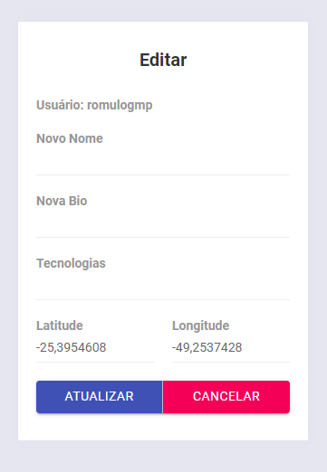

<p align="center"><strong>DevRadar Omnistack#10 - Rocketseat </strong></p>
<p align="center">
  <a aria-label="Versão do Node" href="https://github.com/nodejs/node/blob/master/doc/changelogs/CHANGELOG_V12.md#12.14.1">
    </img>
  </a>
  <a aria-label="Versão do React" href="https://github.com/facebook/react/blob/master/CHANGELOG.md#16120-november-14-2019">
    </img>
  </a>
  <a aria-label="Versão do Expo" href="https://www.npmjs.com/package/expo-cli/v/3.11.5">
    </img>
  </a>
</p>

## Install
Setup MongoDB and update the connection url with your `<username>` and `<password>` in the file `index.js`.  

Install all dependcies and run the server with:
```bash
cd backend
yarn install
yarn dev
```
**Frontend**: execute:
```bash
cd frontend
yarn install
yarn start
```
<p align="center"><strong>Insert Devs Form</strong></p>
</img>
<br/>
<p align="center"><strong>Edit Form</strong></p>
<p align="center"></img></p>

**Mobile**: first, setup your server address on the file `src/services/api.js`, and then execute:
```bash
yarn global add install expo-cli
cd mobile
yarn install
yarn start
```
<p align="center"><strong>Mobile - Real time update with WebScokets</strong></p>
</img>

## Backend
Check [backend/README.md](./backend) about the backend achtecture.

## Frontend
Check [web/README.md](./web) abount the frontend patterns.